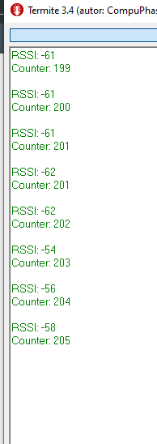
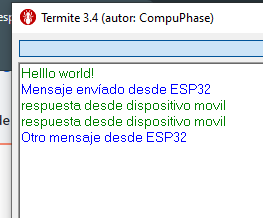
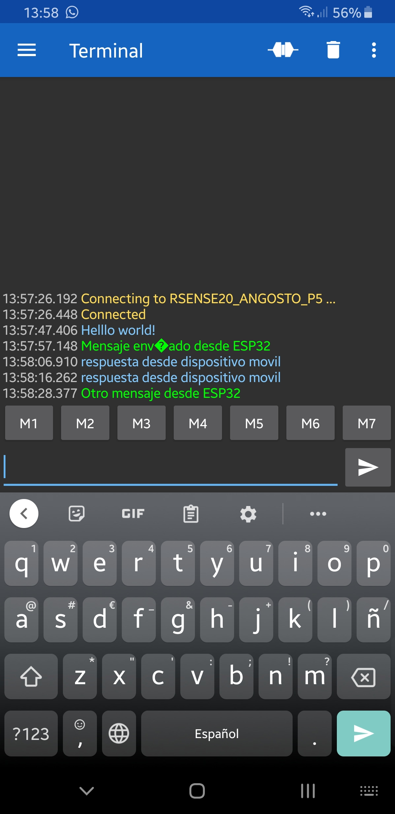

# RSENSE20_ANGOSTO_P5

Desarrollado para la arduino IDE
Repositorio para la práctica P5 de redes de sensores.

## Puntos 2 y 3, iBeacon:
Commit 46dc7995.

Los puntos 2 y 3 de la práctica se realizan de manera conjunta ya que se usa un ESP32 como iBeacon y el otro como lector.

El programa del iBeacon está basado en el ejemplo de arduino de iBeacon server y se modifica para que muestre por panatalla la MAC del dispositivo. En este caso los datos relevantes para la conexión son:

* UUID: 8ec76ea3-6668-48da-9866-75be8bc86f4d
* MAC:  F854F3AB6224

El ejemplo se modifica de tal manera que se envía un contador que incrementa cada segundo.

El programa en el lector de iBeacon se  modifica en base al programa de scaneo de dispositivos Bluetooth, de tal manera que se puede obtener la información del dispositivo deseado simplemente seleccionando los datos en función de la MAC del dispositivo, para ello se introduce en el prorgama la MAC del dispositivo que se quiere leer y se extrae el dato de contrador de la información proporcionada.

Como se usan los valores minor y major del iBeacon la información se encuentra en la información del Manufacturer y no Payload del iBeacon.

En la salida de hiperterminal también se da información sobre el RSSI.

### Captura hiperteminal con datos.

## Punto 4, Communicación serie entre ESP32 y APP:
Commit 46dc7995.

En base al ejemlo de la librería de ESP32 se prepara una comunicación serie entre el ESP32 y otro dispositivo Bluetooth. En este caso se usa un dispositivo móvil con una App. El programa en el ESP32 redirige la información recibida en el puerto serie y la envía por Bluetooth y en sentido contrario con la información recibida por Bluetooth.

## Capturas de la comunicación.

---
## Bibliografía:

* [Guía iBeacon](https://www.mokoblue.com/a-detailed-guide-to-ibeacon/)
* [ESP32 BLE](https://github.com/espressif/arduino-esp32/tree/master/libraries/BluetoothSerial)
* [Bluetooth Serial library](https://github.com/espressif/arduino-esp32/tree/master/libraries/BluetoothSerial)
* [Bluetooth Serial Terminal App](https://play.google.com/store/apps/details?id=de.kai_morich.serial_bluetooth_terminal)
---
David Angosto Latorre, 633706
